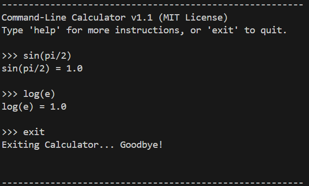

# command-line-calculator
A simple Python command-line calculator. 
This project was created as a practice exercise after completing *Python Crash Course*. 
It is the **v1.0 release** of an ongoing learning project.

---

## Features (v1.0)
- Supports basic arithmetic: `+`, `-`, `*`, `/`
- Supports parentheses `()`
- Supports power: `**`
- Includes math functions: `sqrt()`, `pow()`
- Error handling for invalid input
- MIT License

---

## Installation & Usage
1. Clone the repository:
   ```bash
   git clone https://github.com/<your-username>/command-line-calculator.git
   cd command-line-calculator
   ```

2. Run the calculator:
   ```bash
   python calculator.py
   ```
   

3. Example:
    ```text
    Please enter your equations:
    (10-4)/2 + (6*2)
    Your results:
        (10-4)/2 + (6*2) = 15.0
    ```

---

## Screenshot
Here is a sample run of the calculator:


---

## Roadmap
- v1.1 → Add more math functions (`sin()`, `cos()`, `log()`) ...
- v1.x → Add calculation history & memory features ...
- v2.0 → Build a GUI version (Tkinter or Web) ...

---

## License
This project is licensed under the MIT License.  

See the [LICENSE](LICENSE) file for details.

